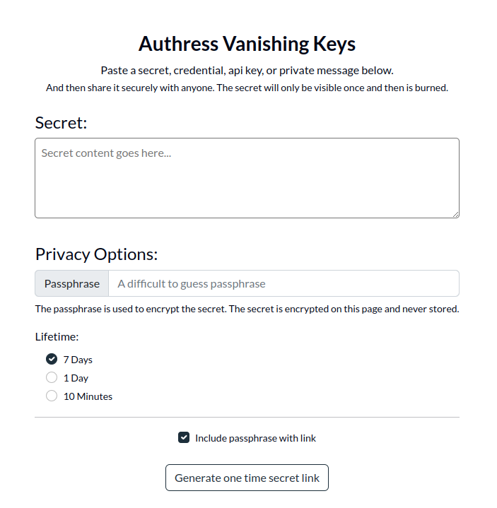

  

# Authress Vanishing Keys

This is the public completely **open source** implementation of how Authress provides the Vanishing Keys service.

Authress Vanishing Keys is deployed to the [Authress Management Portal](https://authress.io) and is available for everyone to use for free.

To send a secret to someone, just click below.

Everything is open source, and **please validate that the passphrase and decrypted secret never leave your browser**.

## [Create a Secret](https://authress.io/app/#/vanish)
Click `Create a Secret` to immediately share a secret using the free community version of the Authress Vanishing Keys service.

## How it works
* Enter your secret at [Authress Vanishing Keys](https://authress.io/app/#/vanish)
* Vanish encrypts your secret on the UI side using a passphrase.
* The encrypted data is sent to Vanish service
* Share the generated link with the intended party
* They use the shared passphrase to decrypt the secret

## One time use
* Once the encrypted data is fetched it is immediately deleted from Authress Vanish. This prevent future Quantum attacks against your credentials.
* Since only the encrypted data is sent to Authress Vanish, no one running the service can decrypt the data even if they wanted to. At no point is the data available

## Components
Vanish is broken down into two parts:
* [UI](https://github.com/Authress/component-library.js) - from the Authress [UI Component Library](https://github.com/Authress/component-library.js). Authress hosts this Ui web component at [Authress Vanishing Keys](https://authress.io/app/#/vanish).
* [Vanish microservice](https://github.com/Authress/vanishing-keys) - The secure microservice which runs Vanish.
